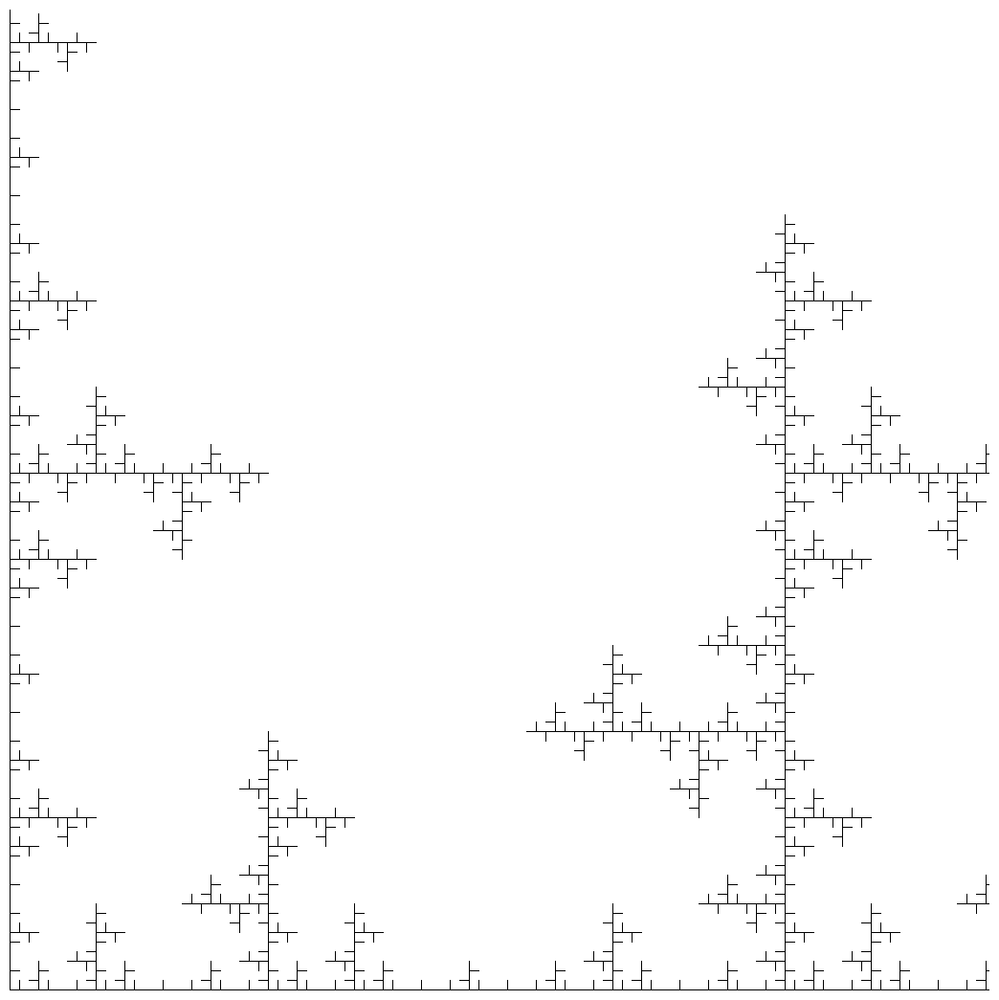
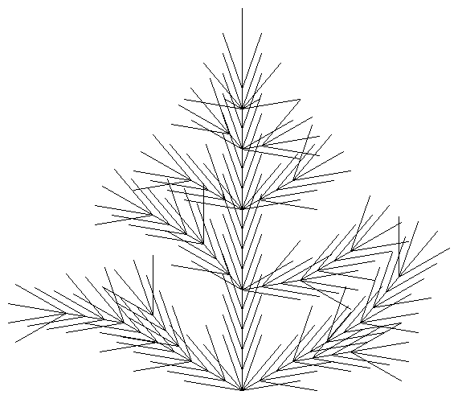

# PHP L-systems

Basic Lindenmayer system generation and rendering classes.

Example l-systems taken from http://paulbourke.net/fractals/lsys/ and other websites.

## Requirements

- PHP +7.4
- Composer

## Usage

```sh
$ composer install
$ php main.php definitions/tree.yaml
$ open tree.png # Or open using any picture viewer
```

## Examples







